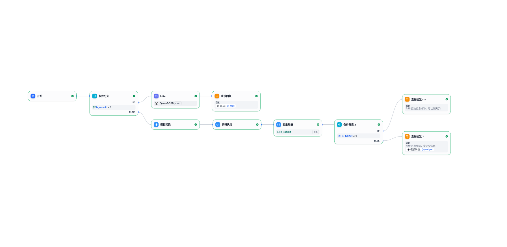
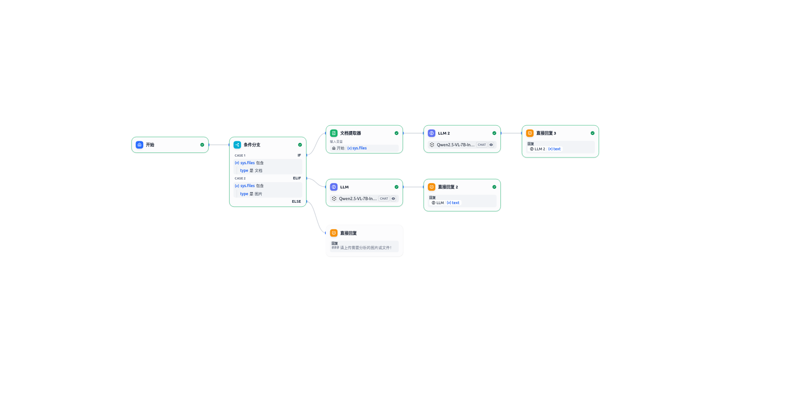

# 常用dify工作流

实用的dify工作流

| 名称                 | 功能描述                                         | 日期      | 作者      | dify版本 | 图示                                 |
| -------------------- | ------------------------------------------------ | --------- | --------- | -------- | ------------------------------------ |
| 表单信息提交系统     | 使用模板转换、会话变量实现表单接口               | 2025.8.6  | hellozahn | 1.7.1    |      |
| 图片文件数据分析助手 | 使用多模态大模型分析图片或文件数据，提供数据分析 | 2025.8.11 | hellozahn | 1.7.1    |  |

