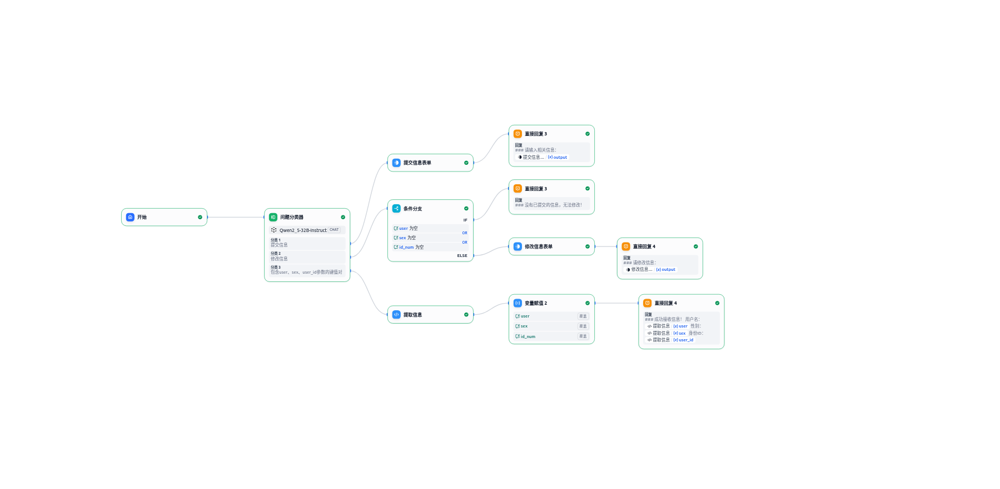

# 常用dify工作流

实用的dify工作流

Dify所有工作流案例说明，同步知乎：[Dify进阶之路](https://www.zhihu.com/column/c_1921488411589575131)

| 名称                 | 功能描述                                         | 日期      | 作者      | dify版本 | 图示                                 | 工作流说明                                                   |
| -------------------- | ------------------------------------------------ | --------- | --------- | -------- | ------------------------------------ | ------------------------------------------------------------ |
| 表单信息提交系统     | 使用模板转换、会话变量实现表单接口               | 2025.8.6  | hellozahn | 1.7.1    |      | [【Dify学习笔记】：Dify搭建表单信息提交系统](https://zhuanlan.zhihu.com/p/1936441788090016457) |
| 图片文件数据分析助手 | 使用多模态大模型分析图片或文件数据，提供数据分析 | 2025.8.11 | hellozahn | 1.7.1    |  | [【Dify学习笔记】：Dify搭建图片文件数据分析助手](https://zhuanlan.zhihu.com/p/1938608085246677461) |

